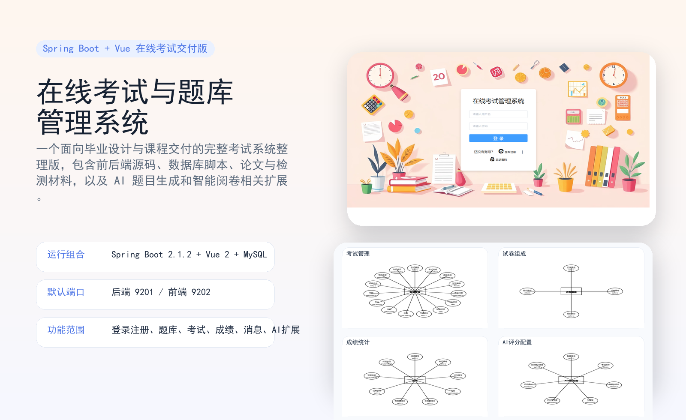
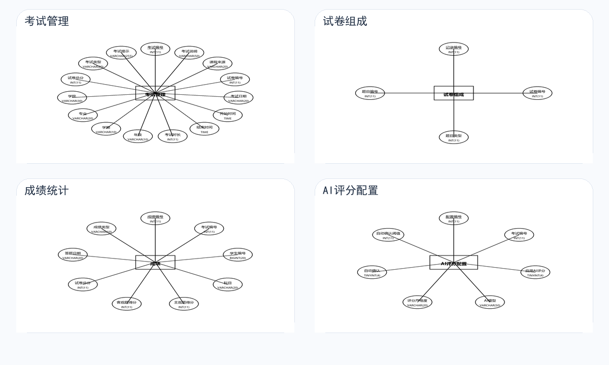
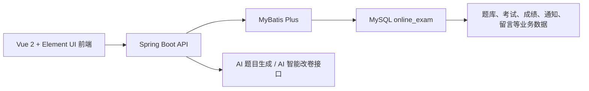

# 在线考试与题库管理系统交付版



一个基于 `Spring Boot + Vue 2 + Element UI + MySQL` 的在线考试与题库管理系统整理交付版。

这个仓库的目标不是只给出源码，而是把**可运行工程、数据库脚本、论文材料、部署说明、测试数据和 README 展示素材**一起整理好，让接手者能够更快理解这个项目到底做了什么、怎么跑、有哪些功能。

## 项目定位

这是一个典型的教务/考试场景管理系统，覆盖了:

- 登录、注册与找回密码
- 题库管理
- 考试管理与自动组卷
- 学生在线答题
- 成绩统计与趋势分析
- 教师交流与通知
- 管理员端用户管理
- AI 生成题目与 AI 智能改卷扩展能力

## 效果预览

### 登录页


### 系统总览示意



### 数据结构示例: 考试管理


### 系统架构



## 功能概览

### 学生端

- 登录、注册、找回密码
- 在线参加考试
- 查看考试详情与个人成绩
- 查看成绩趋势与统计信息

### 教师端

- 题库查询、筛选、编辑、删除
- 添加题目、维护章节与难度等级
- 创建考试、自动组卷
- 学生成绩管理与分数段分析
- 教师交流区与通知
- AI 生成题目
- AI 智能改卷

### 管理员端

- 管理教师与学生信息
- 查看系统总览
- 管理题库、考试、消息与通知
- 独立管理员界面与主题切换能力

## 技术栈

| 层级 | 方案 |
| --- | --- |
| 后端 | `Spring Boot 2.1.2` |
| ORM / 数据访问 | `MyBatis Plus` |
| 前端 | `Vue 2` |
| UI 组件 | `Element UI` |
| 图表与分析 | 前端统计图表组件 |
| 数据库 | `MySQL 5.7 / 8.x` |
| 构建工具 | Maven / Webpack |

## 目录结构

```text
online-exam-system-final-delivery/
├─ OnlineExamSystemApi/              后端源码与已打包 JAR
├─ OnlineExamSystemVue/              前端源码与依赖
├─ apache-maven-3.8.8/               项目自带 Maven
├─ database/                         数据库脚本
├─ docs/
│  ├─ 01_必须保留材料/              论文、任务书、开题报告、核验材料、检测报告
│  └─ 02_项目说明/                  数据库部署、数据导入与测试说明
├─ assets/readme/                    README 配图、结构图、ER 图
├─ start_backend.bat                 后端启动脚本
├─ start_frontend.bat                前端启动脚本
└─ README.md
```

## 运行环境

- `JDK 8`
- `MySQL 5.7` 或 `MySQL 8.x`
- `Node.js 16.13.2` 优先

说明:

- 仓库已自带 `apache-maven-3.8.8`
- 前端依赖偏旧，优先使用 `Node 16.13.2`
- 如果你直接用较新的 `Node 22 / 24`，老旧前端依赖可能报错

## 快速启动

### 第一步: 导入数据库

推荐直接使用:

```text
database/online_exam_one_click.sql
```

它包含:

- 主要表结构
- 题库数据
- 考试与成绩测试数据
- 消息、通知、答题记录等业务数据

参考文档:

- `docs/02_项目说明/数据库部署指南.md`
- `docs/02_项目说明/数据导入和测试指南.md`

### 第二步: 配置后端

配置文件位置:

```text
OnlineExamSystemApi/src/main/resources/application.properties
```

默认关键项:

- 数据库地址: `localhost:3306/online_exam`
- 用户名: `root`
- 数据库密码: `123456`
- 服务端口: `9201`

说明:

- 本仓库中的 AI 配置已经改为占位符，公开仓库不再直接保留真实密钥
- 如果你要使用 AI 生题或 AI 改卷功能，需要自己填写对应平台密钥
- 也可以参考:

```text
OnlineExamSystemApi/src/main/resources/application.example.properties
```

### 第三步: 启动后端

直接运行:

```bat
start_backend.bat
```

脚本逻辑:

- 如果已存在打包好的 JAR，就直接启动
- 如果 JAR 不存在，就调用仓库自带 Maven 先执行打包

后端默认地址:

```text
http://127.0.0.1:9201
```

### 第四步: 启动前端

直接运行:

```bat
start_frontend.bat
```

前端默认地址:

```text
http://127.0.0.1:9202
```

## 默认测试账号

数据库中已经准备了测试数据，建议优先使用以下账号:

| 角色 | 用户名 | 密码 |
| --- | --- | --- |
| 管理员 | `9991` | `123456` |
| 教师 | `20081001` | `123456` |
| 学生 | `20220102` | `123456` |

## 数据与测试说明

当前仓库保留的一键数据库脚本已经足够支撑:

- 题库管理演示
- 在线考试演示
- 成绩统计与分析演示
- 学生、教师、管理员角色演示
- AI 相关业务入口联调

如果你想重点测试“成绩分析”能力，建议重点查看:

- `docs/02_项目说明/数据导入和测试指南.md`

其中已经给出了推荐测试考试编号、预期分析结果和功能检查清单。

## 适合作品集展示的点

- 传统教务系统的完整业务闭环
- Vue 2 + Spring Boot 的前后端分离实践
- 题库、考试、成绩、通知等多模块协作
- 在传统考试系统基础上加入 AI 生题与 AI 改卷能力
- 同时保留论文与项目交付材料，适合作为毕业设计成果整理

## 已知说明

- 这是“交付版 / 整理版”仓库，不是从零搭建的最小精简模板
- 仓库里仍保留了论文及检测材料，更适合完整交付或留档
- 如果你准备长期公开维护，后续可以再拆出一个“纯代码公开版”

## 公开仓库注意事项

- AI 密钥已经从默认配置中脱敏
- 论文、任务书、开题报告等材料仍然属于高敏感内容，公开前请再次确认是否需要继续保留
- 老项目依赖较重，若后续准备长期维护，建议再做一次前端依赖清理与目录瘦身
